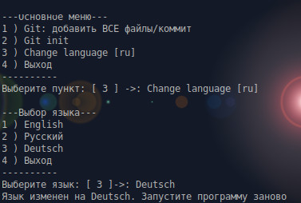

## Локализация своих скриптов на BASH

Создание меню на BASH - задача сама по себе не сложная: "case тебе в руки и echo в спину". Решая её в очередной раз, мне захотелось добавить возможность отображать текст на других языках. Осталось решить, как сделать сам процесс локализации меню более удобным. Если оно большое, то решение "в лоб" превратит его в громоздкую копипасту. Здесь я хотел бы поделиться тем, как решил эту проблему для себя. Надеюсь, для кого то это будет небезынтересным.



Чтобы статья не вылилась в скучную простыню с излишком кода, решил разбить её на две части. В первой рассмотрим создание и добавление дополнительных языков. Во второй - создание многоуровнего меню и сохранение настроек

<details>
  <summary>Примечание</summary>
Я вполне понимаю и принимаю, что существуют и другие языки программирования. Как когда-то кто-то сказал здесь на Хабре - если при написании скрипта на BASH возникает необходимость хоть в одной функции, то лучше взять нормальный язык. Я с этим согласен, но иногда, как говорится, хочется, потому что хочется.
</details>

Мне не хотелось бы разбивать скрипт на несколько частей и хранить локализацию в отдельных файлах. Скрипт тем и удобен, что его проще использовать одним файлом. Поэтому тексты будем хранить в массивах. 

Реализация будет состоять из:
- буквенного кода языка
- массива слов
- преобразователя косвенных ссылок для обращения к массиву
- обращения к элементам массива
- создания меню

Теперь рассмотрим подробнее
<cut />

Зададим язык, добавив короткий буквенный код языка (ru, en), для начала английский:
```bash
langset=en
```
Добавим массивы слов и предложений (по количеству языков):
```bash
language_en=( "English" "Quit" "Hi, Habr!" )
language_ru=( "Русский" "Выход" "Привет, Хабр!" )
```
Создадим косвенную ссылку и сформируем из неё новый массив в переменной *lng*:
```bash
lng="language_$langset[@]"; lng=("${!lng}")
```
То есть здесь для переменной *lng* создаётся значение, состоящее из части имени массива со словами и кода заданного языка из переменной *langset*. Далее создаётся массив, который при *langset=en* будет равен *language_en*, а при *langset=ru* будет равен *language_ru*.
Если языков будет много, то такой подход позволит избавиться от многочисленных *if-elif* или *case*. Чтобы изменить язык, достаточно будет добавить массив с переводом и установить язык в переменной *langset*.

Запустим всё это в консоли:
```bash
language_en=( "English" "Quit" "Hi, Habr!" )
language_ru=( "Русский" "Выход" "Привет, Хабр!" )

langset=en
lng="language_$langset[@]"; lng=("${!lng}")
echo "${lng[2]}"
# Вывод: Hi, Habr!

langset=ru
lng="language_$langset[@]"; lng=("${!lng}")
echo "${lng[2]}"
# Вывод: Привет, Хабр!
```
Таким образом, указывая в начале скрипта двухбуквенный код языка, можно задавать вывод одних и тех же слов или фраз на разных языках. 


## Построение меню
 
А теперь попробуем создать скрипт.
Для примера я взял меню управления командами Git через CLI (*command line interface*). Это немного надуманно, но хорошо подходит для примера, так как в Git много команд и как раз можно построить единое по своей задаче меню с множеством параметров.

Для начала задаем язык и массив с пунктами меню как это уже делали выше. Ради удобства, я разделил массив на две части: первая - это непосредственно меню, вторая - информационные сообщения и приглашения командной строки, которые необходимо будет вывести по ходу работы. 
```bash
#!/bin/bash
# Код языка
langset=en

# Пункты меню
language_en=( "English" "Quit" "Main menu" "Git: add ALL files/commit" "Git init" "Change language" "Language selection" )
message_en=( "English" "Select item" "Wrong! This item does not exist" "Added all files" "Enter you commit" "Changes recorded" "Select a language" "The language has been changed to" "Start the program again" "Menu for language change" )

language_ru=( "Русский" "Выход" "Основное меню" "Git: добавить ВСЕ файлы/коммит" "" "" "Выбор языка" )
message_ru=( "Русский" "Выберите пункт" "Неверно! Этого пункта не существует" "Добавление всех файлов" "Введите ваш коммит" "Изменения зарегистрированы" "Выберите язык" "Язык изменен на" "Запустите программу заново" "Меню для смены языка" )

language_de=( "Deutsch" )
message_de=( "Deutsch" "" "" "" "" "" "" "" "Starten Sie das Programm neu" )
```
Пройдемся по массивам и создадим новые для *lng* и *msg*, которые и будут использоваться:
```bash
languages() {

	lng="language_$langset[@]"; lng=("${!lng}")
	msg="message_$langset[@]"; msg=("${!msg}")

	for b in ${!language_en[@]} ${!message_en[@]} ; do
	
		if [[ ! ${lng[$b]} ]] ; then
			lng[$b]=${language_en[$b]}
		fi
		if [[ ! ${msg[$b]} ]] ; then
			msg[$b]=${message_en[$b]}
		fi
	done
}

languages
```
Чтобы при необходимости иметь возможность применять языковые настройки (это пригодится в следующей статье), заключим всё в функцию и тут же вызовем её.

*Небольшое отступление:* я уверен, почти всем встречались наполовину переведённые приложения. Особенно этим грешат кастомные прошивки для телефонов. Мне никогда это не нравилось, но в данном случае я всё же решил предусмотреть такую возможность неполного перевода. Это позволит при добавлении нового языка не дублировать все элементы массива, а добавить только те, которые пользователю хотелось бы перевести.

Для этого в цикле сравним созданный массив с англоязычным (английский считаем языком по умолчанию): если записи не существует (либо элемент массива пуст), дополним англоязычным вариантом.

Теперь, когда с языками разобрались, приступим к построению меню. Тут всё стандартно: бесконечный цикл, внутри него цикл для вывода элементов на экран и выбор вариантов через *case*.

Формируем массив для вывода на экран. Только те пункты, которые нам нужны:
```bash
local menu0=([1]="${lng[3]}" "${lng[4]}" "${lng[5]}" "${lng[1]}")
```
Здесь делаем индексацию с *1*, чтобы выводить индекс как соответствующий пункт меню.

Добавляем шапку, пробегаемся по индексам через *${!menu0[@]}* и выводим на экран:
```bash
echo
echo "---${lng[2]}---"
for op in "${!menu0[@]}" ; do 
	echo "$op ) ${menu0[$op]}"
done
echo ---------- 
```
Далее предложим пользователю выбрать необходимый пункт. Будем ожидать нажатие цифровой клавиши через *read -s -n1 -p*. Где *-s* - не отображать введённые данные (чаще используется для ввода паролей). Мы же потом сами отобразим введеный текст в более удобном формате. *-p* - строка приглашения для вывода подсказки. *-n1* - параметр, считывающий число симмволов ввода. Здесь мы заранее знаем, что пунктов меню будет не более 9 (то есть числа из одной цифры), поэтому при нажатии одного любого символа программа продолжит работу дальше. Не надо будет нажимать *Enter* для ввода. Немного непривычно, поэтому можно убрать.
```bash
# read со строкой приглашения
read -s -n1 -p "${msg[1]}: " item
#вывод нажатой клавиши
echo "[$item]->: ${menu0[$item]}"
```
Ну и заключительный оператор выбора *case* с обработкой введенного значения:
```bash
case $item in
		# Команды Git, без обработки ошибок (репозитория ведь может и не быть)
	1 ) 	git add .
		read -p "${msg[4]}: " comm
		git commit -m "$comm"
		echo "${msg[5]}" ;;
	2 )	git init ;;
	3 )	echo "${msg[9]}" ;;
		# Выход
	4 )	exit ;;
		# Обработка остальных клавиш и вывод сообщения об ошибке
	* )	echo "[$item]->: ${msg[2]}"; sleep 2 ;;
esac		
```
Здесь *case* сделан упрощенным, только для примера. В следующей статье я буду использовать его в более универсальном варианте.


<details>
  <summary>Весь код</summary>
  
```bash
#!/bin/bash

# Код языка
langset=ru

# Меню и сообщения
language_en=( "English" "Quit" "Main menu" "Git: add ALL files/commit" "Git init" "Change language" "Language selection" )
message_en=( "English" "Select item" "Wrong! This item does not exist" "Added all files" "Enter you commit" "Changes recorded" "Select a language" "The language has been changed to" "Start the program again" "There will be a menu for changing the language" )

language_ru=( "Русский" "Выход" "Основное меню" "Git: добавить ВСЕ файлы/коммит" "" "" "Выбор языка" )
message_ru=( "Русский" "Выберите пункт" "Неверно! Этого пункта не существует" "Добавление всех файлов" "Введите ваш коммит" "Изменения зарегистрированы" "Выберите язык" "Язык изменен на" "Запустите программу заново" "Здесь будет меню для смены языка" )

language_de=( "Deutsch" )
message_de=( "Deutsch" "" "" "" "" "" "" "" "Starten Sie das Programm neu" )

languages() {
	
	# Косвенные ссылки и создание нового массива
	lng="language_$langset[@]"; lng=("${!lng}")
	msg="message_$langset[@]"; msg=("${!msg}")
	
	# Сравнение массивов для проверки на пропущенные элементы
	for b in ${!language_en[@]} ${!message_en[@]} ; do
	
		if [[ ! ${lng[$b]} ]] ; then
			lng[$b]=${language_en[$b]}
		fi
		if [[ ! ${msg[$b]} ]] ; then
			msg[$b]=${message_en[$b]}
		fi
	done
}

languages

main() {

	# Создание и вывод меню на экран
	local menu0=([1]="${lng[3]}" "${lng[4]}" "${lng[5]} [$langset]" "${lng[1]}")
	while true ; do 
		echo
		echo "---${lng[2]}---"
		
		for op in "${!menu0[@]}" ; do 
			echo "$op ) ${menu0[$op]}"
		done
		
		echo ----------
		
		# Ожидание ввода значения
		read -s -n1 -p "${msg[1]}: " item
		echo "[$item]->: ${menu0[$item]}"

		# Оператор выбора
		case $item in
				# Команды Git, без обработки ошибок (репозитория ведь может и не быть)
				
			1 )	
#				git add .
				read -p "${msg[4]}: " comm
#				git commit -m "$comm"
				echo "${msg[5]}" ;;
			2 )	
#				git init ;;
			3 )	echo "${msg[9]}" ;;
				# Выход
			4 )	exit ;;
				# Обработка остальных клавиш и вывод сообщения об ошибке
			* )	echo "[$item]->: ${msg[2]}"; sleep 2 ;;
		esac			
	done
}

main

exit 0

```

</details>


Это первая статья из двух. В следующей рассмотрим создание многоуровнего меню, разукрасим вывод (как же без этого), а также попробуем сохранить настройки, то есть задать код языка прямо из меню, не открывая Shell-скрипт в текстовом редакторе.

Спасибо, что дочитали до конца. Надеюсь, было не скучно.

