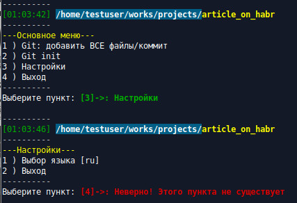
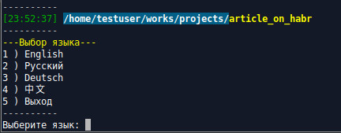
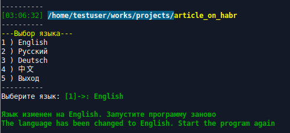

## Локализация своих скриптов на BASH, часть 2

Это продолжение статьи [Локализация своих скриптов на BASH](https://habr.com/ru/post/539586/)
В ней мы используя массивы и косвенные ссылки, научились добавлять в свои скрипты дополнительные языки и переключаться между ними.
В этой статье составим список встроенных языков и зададим выбор языка через меню, построив для этого многоуровневое меню. Чтобы статья не превратилась в один большой кусок кода с описанием каждой строчки, сам код с подробными комментариями я выложу ниже, а здесь затрону только несколько основных моментов.

### Создание меню
В прошлой статье для вывода меню на экран и выбора необходимого пункта мы использовали цикл *for* и оператор выбора *case*. Очевидно, что для создания многоуровнего меню эти шаги нужно будет повторить несколько раз, то есть для каждого подменю. При этом придется заново создавать шапку меню, внешний вид и так далее.
Хороший способ этого избежать - вынести *for*, *case* и *read* в отдельную функцию (назовём её *prints*), а далее будем просто передавать в неё необходимые параметры. Все сценарии, которые будут выполнятся при выборе тех или иных пунктов меню также будут вынесены в соответствующие функции.

Так, чтобы добавить в скрипт новое действие:
- добавляем в языковой массив слова и фразы
- в массив с основным или дополнительным меню вставляем соответствующий пункт и команду вызова функции
- добавляем функцию с необходимым фрагментом кода

Для начала создадим основное меню, которое сразу появится на экране при запуске скрипта:
```bash
menu0=("${lng[3]};main" "${lng[4]};gitadd" "${lng[5]};gitinit" "${lng[2]};options" "${lng[1]};exit")
```

Здесь каждый элемент массива задается двумя параметрами: словесное название необходимого пункта меню, а через разделитель *;* - имя функции, которая будет вызвана. Сделал это для удобства, чтобы не создавать лишний массив для списка команд. Там, куда это все будет передаваться, элемент разделится на две части.
 
Поместим массив в функцию *main*:
```bash
main() {
	# Массив с основным меню
	local menu0=("${lng[3]};main" "${lng[4]};gitadd" "${lng[5]};gitinit" "${lng[2]};options" "${lng[1]};exit")
		
	while true ; do
		
		# Передаем массив в функцию вывода на экран
		# Вторым аргументом идет сообщение, которое отобразится в строке приглашения
		prints "menu0[@]" "${msg[1]}"
	done
}

main
```

При таком подходе создание дополнительных меню немного упрощается, например *options*:
```bash
options() {
	local menu1=("${lng[2]};options" "${lng[7]} [$langset];langmenu" "${lng[1]};exit")
	prints "menu1[@]" "${msg[1]}"
```

Теперь пришло время рассмотреть функцию *prints*, которая выводит все эти меню на экран. Сначала поместим в неё конструкцию, разделяющую элемент на две части. Для разделения задействуем команду вырезания данных *cut*:
```bash
if [[ "$1" == "text" ]] ; then
	# Для текста меню до разделителя
	echo "$2" | cut -d ";" -f 1
	return
elif [[ "$1" == "command" ]] ; then
	# Для команды после разделителя
	echo "$2" | cut -d ";" -f 2
	return
fi
```

Для получения, например, текстового поля вызывать её будем командой *${prints "text" "${menu[0]}"}*  где второй аргумент - сам элемент массива.

***Небольшое, но важное отступление:*** В скрипт я добавил возможность раскрашивать вывод на экран в разные цвета. Отвечающий за это код я поместил в функцию *colors*. Для раскрашивания используются ANSI escape последовательности (вывод *echo -e*) с расширенной палитрой на 256 цветов. 
Также, с прицелом на будущее, я добавил функцию *pwds*, для отображения даты и полного пути текущей директории. Это на случай, если захочется добавить переход по папкам и выбор файлов.

Я не буду описывать эти функции, но они будут в конечном коде с подробными комментариями.

Продолжим рассматривать функцию вывода меню на экран *prints*. Задаем массив из массива, переданного в функцию через аргумент:
```bash	
local menu=("${!1}")
```
	
Далее - непосредственно вывод на экран. Выводим дату и текущий путь, затем название меню желтым цветом, название берется из текстовой части 1 элемента массива:
```bash
pwds
colors "title" "---$(prints "text" "${menu[0]}")---"
```
Перебираем в цикле *for* массив, выводим пункты белым цветом, ожидаем ввод значения *read* и обрабатываем нажатие через оператор выбора *case*:
```bash
for (( op=1; op < "${#menu[@]}"; op++ )); do
	colors "item" "$op ) $(prints "text" "${menu[$op]}")"
done
echo ----------
read -s -n1 -p "$(colors "item" "$2: ")" item	
case $item in
	[1-$((${#menu[@]}-1))] ) 
		# Вывод выбранного пункта меню зеленым цветом
		colors "ok" "[$item]->: $(prints "text" "${menu[$item]}")"
		# Вызов функции с фрагментом кода
		$(prints "command" "${menu[$item]}") ;;
		# Немедленное завершение по [q]
		"q" ) echo; exit;;
		# Обработка остальных клавиш и вывод сообщения об ошибке красным цветом
		* ) colors "err" "[$item]->: ${msg[2]}"; sleep 2 ;;
esac	
```



### Построение меню выбора языка
Часть статьи под этим и следующим заголовоком я считаю самой основной. Она получится короткой, но без рассмотренного выше сложно было бы описать последующий функционал.
Итак, для того, чтобы выбирать язык через меню, составим список встроенных языков. Сначала создадим новую функцию *langmenu*.
Заранее хочу отметить, что мы не знаем количество и какие языки присутствуют в скрипте. Мы просто ищем их все. Для этого пробегаемся по текущему скрипту, через *sed* и регулярное выражение находим все имена массивов *language_* и добавляем коды языков в массив. То есть из *language_ru* выкусываем *ru*:
```bash
# [-r] - расширенный синтаксис регулярных выражений
# [-n] - вывод только того, что совпадает с шаблоном
local lng_sfx=($(sed -r -n "s/^\s?+language_(\w+)=.*/\1/p" "${0}"))
```
Учитывая, что мы не знали какие языки у нас будут, мы не могли сразу задать массив для передачи его в *prints*. Нужно будет собрать его по частям. Сделаем это там же в *langmenu*:
```bash
langmenu(){
	local lng_sfx=($(sed -r -n "s/^\s?+language_(\w+)=.*/\1/p" "${0}"))
	local menu2=("${lng[7]};langmenu")
	
	for a in ${lng_sfx[@]} ; do
		local d="language_$a[@]"; d=("${!d}")
		menu2+=("$d;languages set $a")
	done
	
	menu2+=("${lng[1]};exit")
	prints "menu2[@]" "${msg[6]}"
}
```

Здесь мы:
1. Создаем массив для вывода меню
2. В цикле перебираем массив с кодами языков. На каждой итерации создаем косвенную ссылку, чтобы обратиться к 0 элементу соответствующего языкового массива (с записанным нзванием языка). На следующем шаге мы формируем элемент меню: в каждый элемент в текстовую часть добавляем название языка, а через разделитель *;*, в командную часть, добавляем команду вызова функции *languages* и в качестве аргумента ставим код языка. Для английского языка получится *"English;languages set en"*, где *set en* - аргументы для функции *languages*. 
3. После цикла добавляем в массив с меню команду выхода
4. Передаем сформированный массив с языковым меню в функцию вывода на экран *prints*. Вторым аргументом идет сообщение, которое отобразится в строке приглашения



### Сохранение языка через настройки
После выбора языка через меню запомним его через перезапись в скрипте. применим для этого потоковый редактор *sed* с ключами *-i* и *-r*, где *-i* - редактирование (перезапись) файла, *-r* - поддержка расширенного синтаксиса регулярных выражений.
Здесь всё просто: ищем первое вхождение строки, начинающейся с *langset=* и в ней переменную *langset=* с кодом языка через редактирование перезаписываем новым значением и сразу выходим:
```bash
sed -i -r "0,/^\s?+langset=/s/langset=[\"\']?\w*[\"\']?/langset=\"$langset\"/" "${0}"
exit
```

В предыдущей части мы сформировали языковое меню и передали его в функцию *prints*. Которая, в свою очередь, через оператор выбора *case* вызывает функцию *languages*, описанную в [прошлой статье](https://habr.com/ru/post/539586/) и передаёт в неё аргумент *set* и код выбранного языка. Самое время добавить в *languages* функцию перезаписи настроек, а также вывести на экран сообщение о смене языка в ТЕКУЩЕЙ локализации. После этого применим новый язык и опять выведем то же самое сообщение на НОВОМ языке:

<details>
  <summary>Функция *languages*</summary>
```bash
if [ "$1" == "set" ] ; then
	# Устанавливаем новый язык из входного аргумента
	langset="$2"
	local df="language_$langset"
	echo
	# Сообщение на ТЕКУЩЕМ языке что язык изменен, цвет зеленый
	colors "ok" "${msg[7]} ${!df}. ${msg[8]}"
	# Применяем настройки языка
	languagesа
	# Сообщение на НОВОМ языке что язык изменен, цвет зеленый
	colors "ok" "${msg[7]} ${lng[0]}. ${msg[8]}"
	echo
	# Перезаписываем переменную langset= с кодом языка и выходим
	sed -i -r "0,/^\s?+langset=/s/langset=[\"\']?\w*[\"\']?/langset=\"$langset\"/" "${0}"
	exit 
fi
```

</details>



### Заключение
В этой и [прошлой](https://habr.com/ru/post/539586/) статьях мы создали шаблон, который можно использовать для написания своих скриптов с возможностью отображения экранного меню и сообщений на разных языках. При этом скрипт состоит из одного файла и для добавления нового языка достаточно закинуть массив со словами в начало скрипта, а для добавления какого либо действия - создать функцию и прописать её в меню.
Спасибо, что дочитали до конца. Весь код с комментариями прикреплен ниже.

<details>
  <summary>Весь код</summary>
```bash
#!/bin/bash
# Код языка
langset="ru"

# Меню и сообщения
language_en=( "English" "Quit" "Options" "Main menu" "Git: add ALL files/commit" "Git init" "Change language" "Language selection" )
message_en=( "English" "Select item" "Wrong! This item does not exist" "Added all files" "Enter you commit" "Changes recorded" "Select a language" "The language has been changed to" "Start the program again" "Repository not found\nPlease, select Git init pepository" )

language_ru=( "Русский" "Выход" "Настройки" "Основное меню" "Git: добавить ВСЕ файлы/коммит" "" "" "Выбор языка" )
message_ru=( "Русский" "Выберите пункт" "Неверно! Этого пункта не существует" "Добавление всех файлов" "Введите ваш коммит" "Изменения зарегистрированы" "Выберите язык" "Язык изменен на" "Запустите программу заново" "Репозиторий не найден\nПожалуйста, инициализируйте репозиторий, выбрав Git init" )

language_de=( "Deutsch" )
message_de=( "Deutsch" "" "" "" "" "" "" "" "Starten Sie das Programm neu" )

language_cn=( "中文" "出口" "设置" "主菜单")
message_cn=( "中文" "选择项目" "" "" "" "" "选择语言" "语言已改为" "重新启动程序" )

#Settings section

languages() {
	# Функция с языковыми настройками и установкой нового языка
	# Косвенные ссылки и создание нового массива
	lng="language_$langset[@]"; lng=("${!lng}")
	msg="message_$langset[@]"; msg=("${!msg}")

	# Сравнение массивов для проверки на пропущенные элементы
	for b in ${!language_en[@]} ${!message_en[@]} ; do
	
		if [[ ! ${lng[$b]} ]] ; then
			lng[$b]=${language_en[$b]}
		fi
		if [[ ! ${msg[$b]} ]] ; then
			msg[$b]=${message_en[$b]}
		fi
	done

	# Установка нового языка
	if [ "$1" == "set" ] ; then
		
		# Устанавливаем новый язык из входного аргумента
		langset="$2"

		local df="language_$langset"
		
		# Выводим сообщение на ТЕУЩЕМ языке что язык изменен,
		# пишем какой выбрали, предлагаем перезапустить программу
		echo
		colors "ok" "${msg[7]} ${!df}. ${msg[8]}"
		
		# Применяем настройки языка
		languages
		
		# Выводим сообщение на НОВОМ языке что язык изменен
		# пишем какой выбрали, предлагаем перезапустить программу
		colors "ok" "${msg[7]} ${lng[0]}. ${msg[8]}"
		echo
		# Через регулярное выражение путем изменения файла
		# перезаписываем переменную langset= с кодом языка и выходим
		# [-r] - расширенный синтаксис регулярных выражений
		# [-i] - редактирование файла
		# [0,] - только первое вхождение
		sed -i -r "0,/^\s?+langset=/s/langset=[\"\']?\w*[\"\']?/langset=\"$langset\"/" "${0}"
		exit 
	fi
}

# Применяем настройки языка
languages


colors() {
	# Установка цвета текста и фона. Строки даны полностью,
	# чтобы можно было просто изменить цифры, ничего не дописывая
	# Здесь [48] - код расширенной палитры фона, [38] - текста
	# [5] - 8-битный формат цвета (0-255), [1] - жирный,
	# [22] - отменить жирный, [0] - сбросить все изменения
	case "$1" in
		# Текст: темно-зеленый (часы)
		"tm" ) echo -e "\e[48;5;256;38;5;34;22m$2\e[0m" ;;
		# Фон: светло-синий, текст: белый жирный (часть полного пути)
		"pt" ) echo -e "\e[48;5;24;38;5;15;1m$2\e[0m" ;;
		# Текст: светло-желтый жирный (текущая папка)
		"cf" ) echo -e "\e[48;5;256;38;5;226;1m$2\e[0m" ;;
		# Текст: темно-зеленый жирный (цвет успешной операции)
		"ok" ) echo -e "\e[48;5;256;38;5;34;1m$2\e[0m" ;;
		# Текст: красный жирный (цвет ошибки)
		"err" ) echo -e "\e[48;5;256;38;5;160;1m$2\e[0m" ;;
		# Текст: светло-желтый (шапка меню)
		"title" ) echo -e "\e[48;5;256;38;5;226;22m$2\e[0m" ;;
		# Текст: белый (пункты меню и строка приглашения)
		"item" ) echo -e "\e[48;5;256;38;5;15;22m$2\e[0m" ;;
	esac
	
}

pwds() {
	# Цветное отображение полного пути текущей директории и даты
	echo 
	echo ----------
	echo "$(colors 'tm' "[$(date +"%T")]") $(colors 'pt' "${PWD%/*}"/)$(colors 'cf'  "$(basename   "$PWD")")"
	echo ----------
}

prints() {
	# Функция вывода меню на экран
	
	# Разделение элемента массива на текст и команду, в качестве разделителя [;]
	if [[ "$1" == "text" ]] ; then
		echo "$2" | cut -d ";" -f 1
		return
	elif [[ "$1" == "command" ]] ; then
		echo "$2" | cut -d ";" -f 2
		return
	fi
	
	# Задаем массив из массива, переданного в функцию через аргумент
	local menu=("${!1}")
	
	# Вывод даты и текущего пути
	pwds
		
	# Вывод названия меню желтым цветом, название берется
	# из текстовой части 1 элемента массива 	
	colors "title" "---$(prints "text" "${menu[0]}")---"
	
	# Вывод меню на экран
	for (( op=1; op < "${#menu[@]}"; op++ )); do
		
		# Вывод пунктов меню белым цветом, названия берутся
		# из текстовой части соответствующего элемента массива
		colors "item" "$op ) $(prints "text" "${menu[$op]}")"
	done
	
	echo ----------
	
	# Ожидание ввода значения, приглашение выводится белым цветом
	read -s -n1 -p "$(colors "item" "$2: ")" item	
	
	# Оператор выбора
	case $item in
		# Все числа от 1 до размера всего массива минус 1 (так как индексация массива с 0)
		# Вывод выбранного пункта меню зеленым цветом название берется
		# из текстовой части соответствующего элемента массива
		[1-$((${#menu[@]}-1))] ) colors "ok" "[$item]->: $(prints "text" "${menu[$item]}")"
		
		# Вызов функции с фрагментом кода, имя функции берется
		# из командной части соответствующего элемента массива
		$(prints "command" "${menu[$item]}") ;;
		
		# Немедленное завершение по [q]
		"q" ) echo; exit;;
		
		# Обработка остальных клавиш и вывод сообщения об ошибке красным цветом
		* ) colors "err" "[$item]->: ${msg[2]}"; sleep 2 ;;
	esac	
}


#Application section

gitinit() {
	# Для примера: фрагмент кода для [git init]
	git init
}

gitadd() {
	# Для примера: фрагмент кода для [git add] - добавить все файлы
	git add .
	# Обработка ошибок. Если статус завершения команды не равен [0]
	# вывести сообщение об ошибке красным цветом и вернуться в меню
	if [[ "$?" != "0" ]] ; then
		colors "err" "${msg[9]}" 
		sleep 1
		return 1 
	fi
	
	echo "${msg[3]} ..."
	# Приглашение и ввод коммита
	read -p "$(colors "item" "${msg[4]}: ")" comm
	git commit -m "$comm"
	# сообщение о завершении операции зеленим цветом
	colors "ok" "${msg[5]}"
}


# Menu section

langmenu(){
	# Функция создания языкового меню
	# Проходим по текущему скрипту, через регулярное выражение находим
	# все имена массивов [language_*] и добавляем коды языков в массив
	# [-r] - расширенный синтаксис регулярных выражений
	# [-n] - вывод только того, что совпадает с шаблоном
	local lng_sfx=($(sed -r -n "s/^\s?+language_(\w+)=.*/\1/p" "${0}"))
	
	# Создаем массив для вывода меню	
	local menu2=("${lng[7]};langmenu")
	
	# Перебираем в цикле массив с кодами языков, на каждой итерации создаем косвенную ссылку,
	# чтобы обратиться к 0 элементу соответствующего языкового массива (с записанным нзванием языка)
	for a in ${lng_sfx[@]} ; do
		local d="language_$a[@]"; d=("${!d}")
		
		# Продолжаем формирование массива для вывода языкового меню
		# В каждый элемент в текстовую часть добавляем название языка, а через
		# разделитель [;], в командную часть, добавляем команду вызова функции
		# [languages] и в качестве аргумента ставим код языка. Для английского языка
		# получится ["English;languages set en"], где [set en] - аргументы для функции [languages]
		menu2+=("$d;languages set $a")
	done
	# Добавляем в меню команду выхода
	menu2+=("${lng[1]};exit")
	
	# Передаем сформированный массив с языковым меню в функцию вывода на экран
	# Вторым аргументом идет сообщение, которое отобразится в строке приглашения
	prints "menu2[@]" "${msg[6]}"
}

options() {
	# Функция создания меню с настройками
	# В каждый элемент в текстовую часть добавляем название необходимого пункта меню,
	# а через разделитель [;], в командную часть, добавляем соответствующую команду вызова функции
	local menu1=("${lng[2]};options" "${lng[7]} [$langset];langmenu" "${lng[1]};exit")
	
	# Передаем массив в функцию вывода на экран
	# Вторым аргументом идет сообщение, которое отобразится в строке приглашения
	prints "menu1[@]" "${msg[1]}"
}

main() {
	# Функция создания основного меню
	# В каждый элемент в текстовую часть добавляем название необходимого пункта меню,
	# а через разделитель [;], в командную часть, добавляем соответствующую команду вызова функции
	# Здесь и в других массивах, содержащих меню, первая запись - это название и команда вызова текущей функции
	# Необходимо для того, чтобы передавать название меню для печати шапки и для вызова этой функции при необходимости
	local menu0=("${lng[3]};main" "${lng[4]};gitadd" "${lng[5]};gitinit" "${lng[2]};options" "${lng[1]};exit")

	
	while true ; do
		# Передаем массив в функцию вывода на экран
		# Вторым аргументом идет сообщение, которое отобразится в строке приглашения
		prints "menu0[@]" "${msg[1]}"
	done
}

main

exit 0
```
  
</details>
